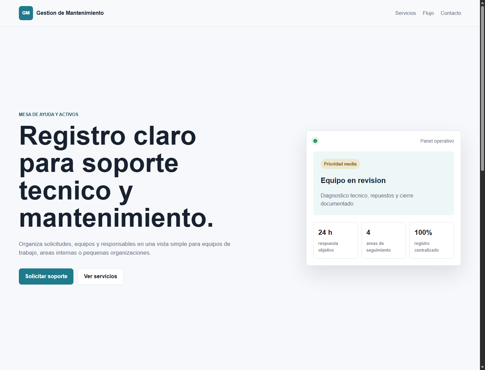
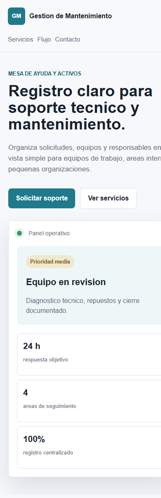

# Gestion de Mantenimiento

Aplicacion web en Django para registrar solicitudes, equipos y tareas de soporte tecnico. El contenido esta escrito con nombres genericos para que el proyecto pueda adaptarse a cualquier equipo, empresa, institucion o area interna.

## Capturas

### Vista escritorio



### Vista movil



## Funcionalidades actuales

- Pagina principal responsive con contenido generico.
- Secciones de servicios, flujo de trabajo y contacto.
- Panel de resumen operativo para destacar estado, tiempos y seguimiento.
- Configuracion regional para Chile: idioma `es-cl` y zona horaria `America/Santiago`.
- Archivos estaticos organizados en `pagina_curso/static`.

## Tecnologias

- Python
- Django
- HTML
- CSS
- SQLite

## Instalacion

1. Crear un entorno virtual:

```powershell
python -m venv .venv
```

2. Activar el entorno:

```powershell
.venv\Scripts\Activate.ps1
```

3. Instalar dependencias:

```powershell
pip install -r requirements.txt
```

4. Ejecutar el servidor:

```powershell
cd pagina_curso
python manage.py runserver
```

5. Abrir la pagina:

```text
http://127.0.0.1:8000/
```

## Estructura principal

```text
.
├── docs/screenshots/
├── pagina_curso/
│   ├── mantenimiento/
│   ├── pagina_curso/
│   ├── static/css/site.css
│   └── templates/mantenimiento/home.html
├── requirements.txt
└── README.md
```

## Notas

El proyecto esta listo como base visual. El siguiente paso natural es agregar modelos para equipos, solicitudes, estados y responsables, y conectar formularios reales para registrar mantenimientos.
